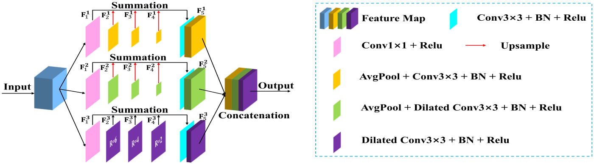

# FSMINet (GRSL 2022)
'[Fully Squeezed Multi-Scale Inference Network for Fast and Accurate Saliency Detection in Optical Remote Sensing Images](https://ieeexplore.ieee.org/iel7/8859/4357975/09739705.pdf)', [Kunye Shen](https://scholar.google.com.hk/citations?hl=zh-CN&user=q6_PkywAAAAJ), [Xiaofei Zhou](https://scholar.google.com.hk/citations?hl=zh-CN&user=2PUAFW8AAAAJ), Bin Wan, Ran Shi, Jiyong Zhang.

## Required libraries

Python 3.7  
numpy 1.18.1  
scikit-image 0.17.2  
PyTorch 1.4.0  
torchvision 0.5.0  
glob 

The SSIM loss is adapted from [pytorch-ssim](https://github.com/Po-Hsun-Su/pytorch-ssim/blob/master/pytorch_ssim/__init__.py).

## Usage
1. Clone this repo
```
https://github.com/Kunye-Shen/FSMINet.git
```

2. We provide the predicted saliency maps ([GoogleDrive](https://drive.google.com/drive/folders/1gbhZJePO20P8ncFoq0pA9XjOnFRN_5iP?usp=sharing) or [baidu](https://pan.baidu.com/s/1w9VaKXJSY5OZetQec8Hxdw) extraction code: 12so.). You can download directly through the above methods, or contact us through the following email.
```
KunyeShen@outlook.com
```

## Architecture
### FSM Module


### FSMINet


## Quantitative Comparison


## Qualitative Comparison


## Citation
```
@article{shen2022fully,
  title={Fully Squeezed Multi-Scale Inference Network for Fast and Accurate Saliency Detection in Optical Remote Sensing Images},
  author={Shen, Kunye and Zhou, Xiaofei and Wan, Bin and Shi, Ran and Zhang, Jiyong},
  journal={IEEE Geoscience and Remote Sensing Letters},
  year={2022},
  publisher={IEEE}
}
```
